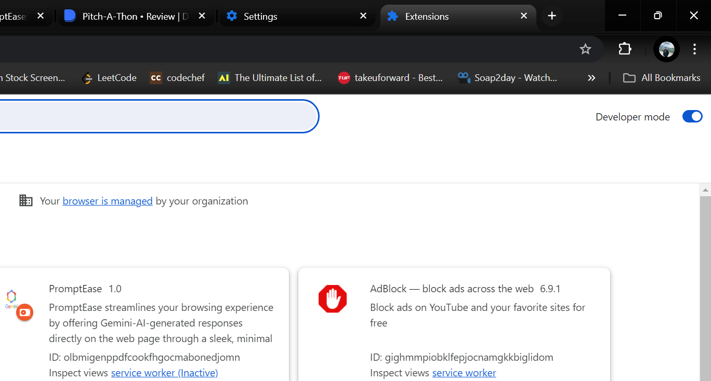
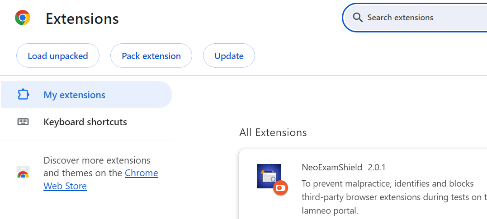
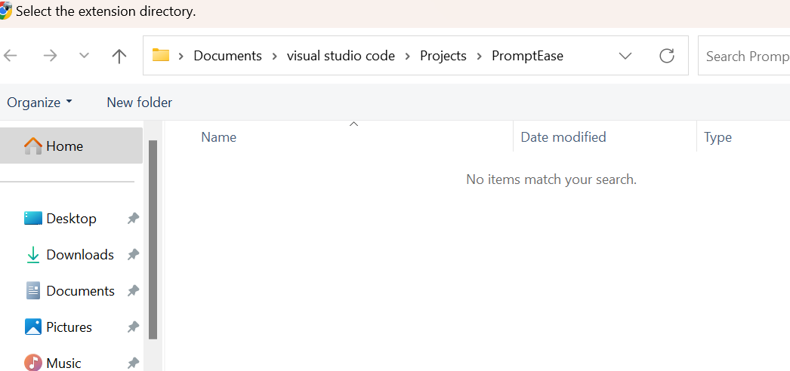
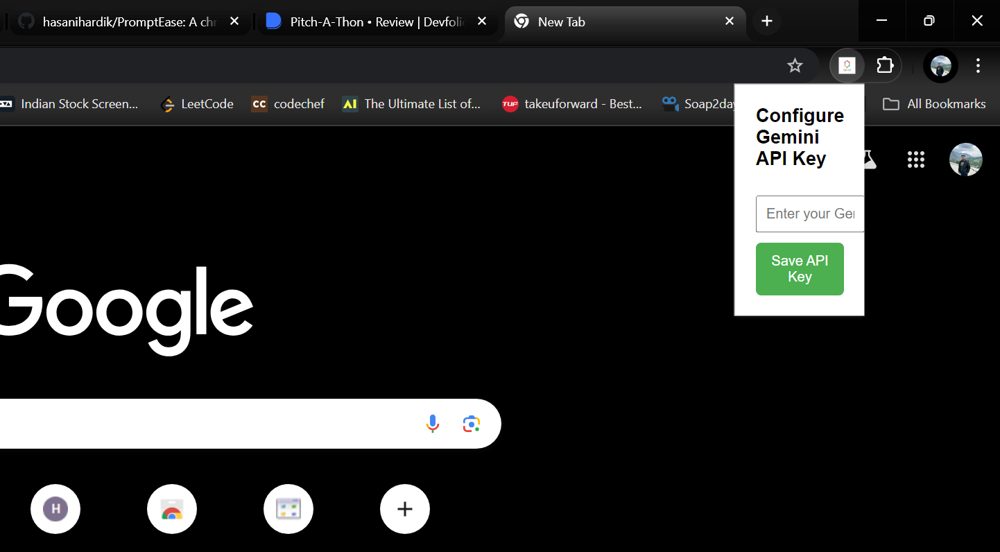
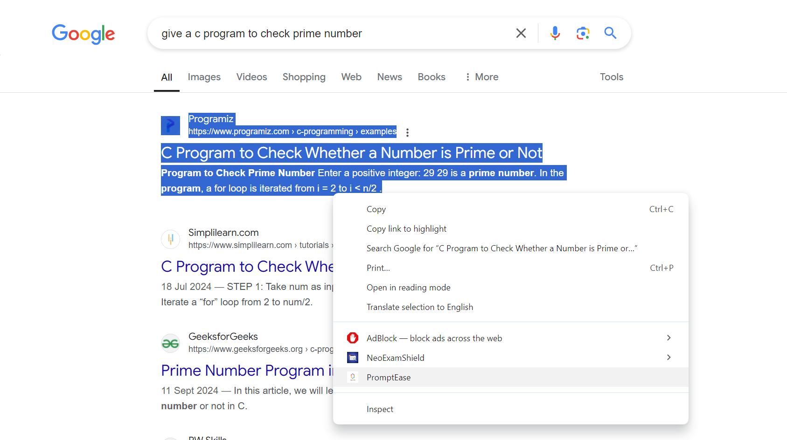
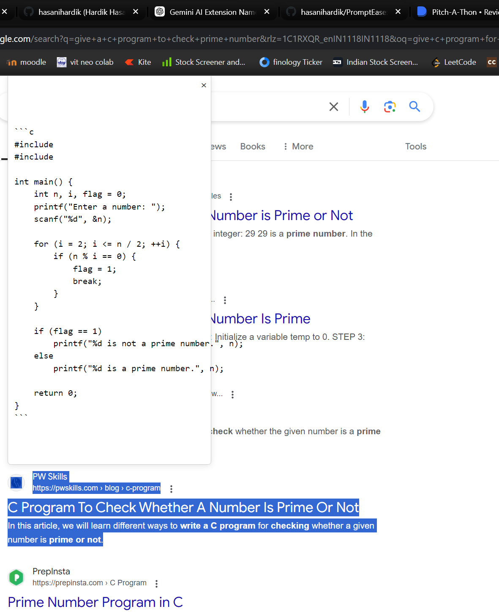

# PromptEase
A chrome extension to get ai based response for selected text in any webpage.

# Installation:

1) clone this repo
2) enable developer mode in chrome extensions
3) click on load unpacked and selected the repository
4) the extension will be installed in your chrome
5) get a gemini api key from google ai studio
6) add that api key in popup box (it will appear after clicking the extension icon)
7) you are good to go... select any question/program, right click and click on PromptEase, within seconds you'll have your output on screen... 

# Future Upgrades

1) fix the popup key box (will be done soon)
2) add MCQ Solver functionality to quickly solve MCQs across platforms
3) fix the output box...
4) expand it to GPT 3.5 mini, GPT 4, Claude etc

# Screenshots

Enable Developer Mode

Select on Load Unpacked

Locate and selected the Repository folder to add the extension to chrome

Adding API Key

Select text and right click 

Output will appear like this on screen

